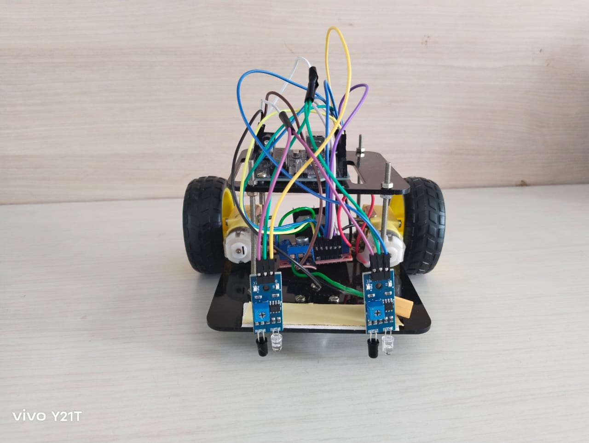

# Black_Line_Follower_RC_bot

## Project Overview

This project introduces a Bluetooth-controlled RC bot, a remote-controlled robot that can be manipulated using a smartphone application. The Bluetooth RC car app installed on the smartphone communicates with the robot, allowing users to control its movements in different directions.

## Table of Contents

- [Introduction](#introduction)
- [Components](#components)
- [Circuit Connections](#circuit-connections)
- [Prototype](#prototype)
- [Code](#code)
- [Conclusion](#conclusion)

## Introduction

Line follower robots are used in semi as well as fully autonomous plants. The line follower is a self-operating robot that detects and follows a line that is drawn. The path consists of a black line on a white surface. The sensors that can be used are typically LED/LDR, LED/Photodiode or LED/Phototransistor pairs.

## Components

- Arduino Uno - 1 Unit

- L298N Motor Driver - 1Unit

- IR Sensor - 2 Unit

- BO Motor with Wheel - 2 Unit

- Jumper Wire

## Prototype
The Black Line Follower Robot is a prototype designed for automated navigation along a black line on a contrasting surface. This project combines sensors, actuators, and a microcontroller to create an intelligent robot capable of following a predetermined path.

- Circuit

## Code

[Link to Code](https://docs.google.com/document/d/1yOwO8bCl489hEB7cHf8Prr4tpoaIlrI_q3_zQLsGZC8/edit?usp=sharing)

## Conclusion

The black line follower RC bot effectively addresses the problem of autonomously tracking and following a black line. Its purpose-built design, featuring sensors, control systems, and actuators, allows it to precisely follow the path marked by the line. This solution meets the requirements of the problem by providing an educational and practical platform for learning about sensor-based navigation and robotics control.

The bot serves as an ideal tool for hobbyists and students to gain hands-on experience in robotics, programming, and sensor technologies. Additionally, it is often used in competitive settings, encouraging innovation and skill development in the field. The black line follower RC bot is a practical embodiment of autonomous navigation and a valuable tool for those seeking to explore the world of robotics.

Feel free to contribute, report issues, or suggest improvements!